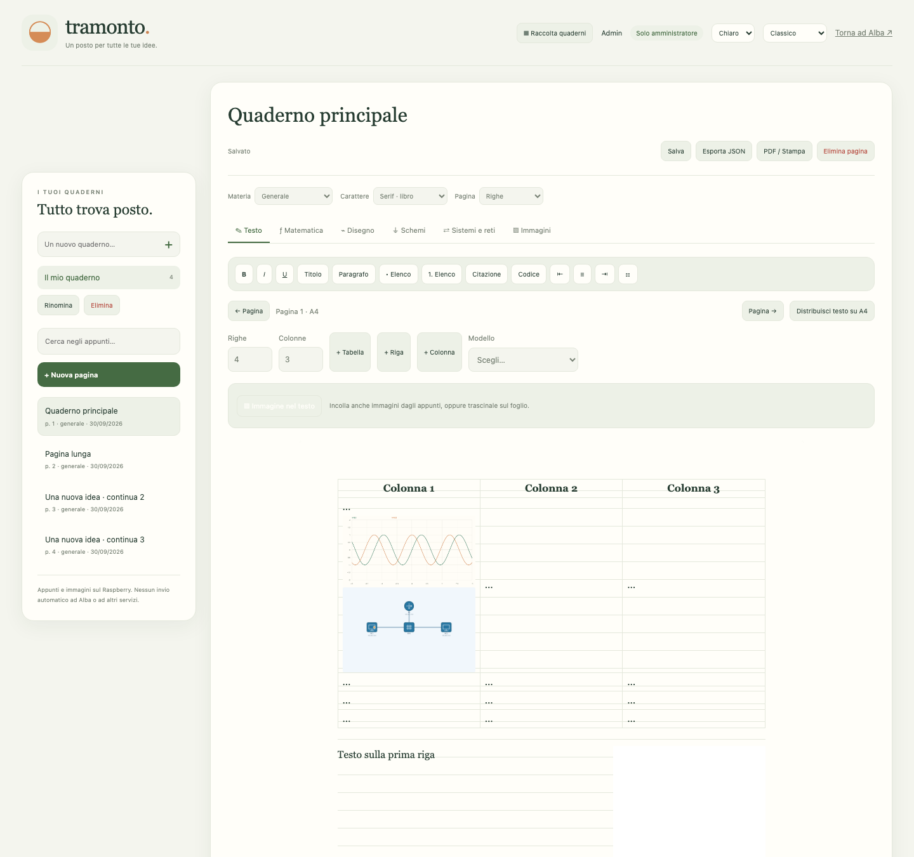

# Alba + Tramonto + Notte

AI conversazionale locale, Telegram e web, con memoria nel tempo. **Notte / ALBA-CORE** aggiunge una personalità autonoma con emozioni persistenti, memoria vettoriale locale, riflessione, riassunti, ricerca Wikipedia e messaggi Telegram a Matt. [Architettura, configurazione e limiti di ALBA-CORE](docs/ALBA_CORE.md). Tramonto è il quaderno riservato all’amministratore: pagine A4, immagini nel testo, matematica, disegno, circuiti ngspice e reti didattiche.



- Memorie private e di gruppo separate; fatti dichiarati, inferenze e informazioni incerte con fonti e stato. SQLite FTS5, contesto limitato, profili persistenti e feedback per utente. Non effettua fine-tuning dei pesi del modello.
- Telegram privato/gruppi: menzioni, reply, comandi e modalità automatica configurabile. Sito con lo stesso archivio Telegram dopo un’associazione verificata.
- Chiavi web monouso e password personali, browser ricordati e revocabili. Accessi opzionali Google/GitHub/Discord/Twilio Verify configurabili con segreti cifrati. Nessuna fusione automatica per email.
- 20 utenti autorizzati, 5 persone attive, coda, Stop, limiti mensili di token, calendario di utilizzo, CPU/RAM/disco ogni 2 secondi, audit e backup cifrati con retention.
- Tema chiaro/scuro, classico/neomorfismo/vetro, logo animato e Albi, mascotte albicocca originale.
- Tramonto: raccolta quaderni, otto stili di carta, quattro font, tabelle e modelli. Pagine A4 numerate, continuazione del testo lungo e ripristino della pagina/posizione. Immagini incollate/caricate, trascinabili e ridimensionabili, con testo a fianco. Formule, grafici e laboratori inseribili nella pagina come immagini PNG, con selezione, maniglia di ridimensionamento, larghezza, allineamento e spostamento nel testo. Comandi raggruppati, impostazioni dell’oggetto accanto al foglio e stampa della sola pagina A4.
- Aspetto di Alba e Tramonto: Classico, Neomorfismo, Vetro, Claymorphism, Cybercore, Neobrutalism, Scrapbook e Surrealism. Luminosità chiara/scura/grigia/nera e sei palette indipendenti, conservate sul dispositivo. Menu Aspetto su Alba, anche prima del login; stampa A4 di Tramonto bianca senza decorazioni. Icone Lucide locali con licenza inclusa.
- Matematica: LaTeX/KaTeX, tre curve, funzioni trigonometriche/iperboliche, limiti numerici, derivate simboliche, integrali e zeri numerici. Le stime numeriche non sostituiscono dimostrazioni.
- Elettronica: 28 dispositivi, generatore di funzioni, strumenti, fili, rotazione/undo; ngspice locale isolato per DC, transitorio, sweep AC e DC, grafici/CSV/netlist. Modelli generici didattici, non una replica di Multisim.
- Reti: nove dispositivi, cavi, VLAN, gateway e interfacce; ping animato e traceroute didattici, controllo IP/gateway/collegamenti, duplicazione e disposizione a griglia. CIDR con intervallo host/wildcard, suddivisione uniforme e VLSM, rapporti e tabelle inseribili nel quaderno. Selezione multipla con Maiusc/clic, pressione prolungata o area, spostamento del gruppo, Canc/Delete e Annulla nei circuiti e nelle topologie. Console show/diagnose/traceroute. Non esegue Cisco IOS né invia pacchetti reali; il routing tra più router non è implementato.

## Installazione Linux / Raspberry Pi

Requisiti consigliati: Raspberry Pi 5, 8 GB, Linux 64 bit, almeno 10 GB liberi per modelli e dati. Il setup analizza RAM/CPU/disco e sceglie il modello iniziale. I 750 GB non sono necessari: la retention si configura in `.env`.

```sh
git clone https://github.com/Dvlce/alba-tramonto.git
cd alba-tramonto
python3 install.py
```

Il setup installa dipendenze Linux, ambiente Python, Ollama se assente, modello e servizio. Chiede in modo protetto il token BotFather e l’ID admin; puoi omettere Telegram e creare un amministratore locale da terminale. Conserva una `.env` esistente. I download richiedono internet durante il setup; le risposte del modello girano localmente. `--skip-system`, `--no-model`, `--no-service` permettono installazioni personalizzate.

Credenziali iniziali in `data/first-access.txt`, permessi 0600: leggile dal terminale, conservale e rimuovi il file. Il server ascolta **solo su 127.0.0.1:8088**. Pubblicalo con un reverse proxy HTTPS; configura `PUBLIC_URL` e riavvia. Tailscale Funnel è una possibilità: gli utenti del sito e Telegram non devono installare Tailscale. Non pubblicare la porta Ollama o il database.

Il servizio generato dal setup gira come l’utente installatore. Per un’installazione più protetta usa un utente di servizio dedicato e adatta `deploy/alba.service`; [SICUREZZA.md](SICUREZZA.md) descrive le misure applicate sull’installazione di riferimento. `deploy/harden_pi.py` è specifico di quella macchina: leggerlo e adattare utenti/chiavi prima di usarlo altrove. Non cambia SSH/firewall automaticamente durante il setup generale.

Backend e modello sono sostituibili:

```ini
MODEL=qwen3:4b-instruct-2507-q4_K_M
LLM_BACKEND=ollama
LLM_URL=http://127.0.0.1:11434
MAX_USERS=20
MAX_ONLINE=5
```

Con 8 GB, il modello quantizzato 4B e SQLite sono una scelta leggera; viene eseguita una generazione alla volta. I cinque posti non significano cinque modelli caricati. Con meno RAM il setup propone `qwen3:1.7b`. Per llama.cpp usa `LLM_BACKEND=llamacpp` e il suo endpoint OpenAI-compatible locale. Valuta qualità e latenza sul tuo hardware prima di cambiare modello.

## Telegram, sito e accessi esterni

Crea il bot con BotFather; imposta il token nel setup o in `.env`. Per i gruppi abilita i messaggi necessari nelle impostazioni BotFather e aggiungi il bot. `/start`, `/help`, `/profile`, `/memory`, `/timeline`, `/search`, `/stats`, `/export`, `/export_key`, `/export_personality`, `/export_prompt`, `/forget`, `/backup`, `/web_key`, `/web_password`, `/feedback`, `/memory_key`, `/stop`. Comandi admin separati; le operazioni sono registrate. Per configurare un gruppo l’amministratore Alba deve essere anche amministratore Telegram del gruppo.

`/web_key` in privato genera un pulsante di login personale: la chiave è nel frammento URL, rimossa subito dal browser e consumata una volta. Con accesso automatico attivo si autorizza fino al limite di 20. `/web_password` crea o rinnova le proprie credenziali. Esportazioni solo con verifica privata e chiave monouso; l’admin non recupera password o chiavi originali. I file separano dati originali, riassunti, inferenze e incertezze, senza includere dati privati di gruppi/altri utenti.

L’amministratore può richiedere dal pannello il consenso per consultare le memorie di un utente. La persona genera `/memory_key` nella propria chat privata e consegna volontariamente il codice: monouso e valido 15 minuti, apre una consultazione di 15 minuti per quell’amministratore. `/memory_key revoke` revoca codici e accessi. Il permesso non consente esportazioni; chiavi e dati non vengono registrati nei log.

Google/GitHub/Discord/SMS sono **predisposti, disabilitati senza credenziali**. [Istruzioni complete](ACCESSI_ESTERNI.md). Google usa identità/email/profilo, non legge Gmail. Per mantenere l’identità Telegram, accedi prima con Telegram e collega il provider dalla sezione Dispositivi.

Da terminale, con permessi del gestore:

```sh
.venv/bin/python cli.py users
.venv/bin/python cli.py allow ID_TELEGRAM
.venv/bin/python cli.py web-key ID_TELEGRAM
.venv/bin/python cli.py password ID_TELEGRAM
.venv/bin/python maintenance.py backup
```

Restore: ferma il servizio, poi `maintenance.py restore FILE --service-stopped`; richiede le chiavi locali e invalida gli accessi precedenti. I backup sono cifrati, il database live è protetto dai permessi. `/forget all confermo` cancella anche i backup precedenti dell’installazione; le copie già scaricate e i messaggi Telegram vanno rimossi separatamente.

## Android e integrazione

APK in [Releases](https://github.com/Dvlce/alba-tramonto/releases), oppure `/download/alba-albi.apk` se il gestore lo ha installato sul server. La versione 1.2.0 apre Alba, Tramonto e Notte al suo interno, senza lanciare il browser. Include Android App Links verificati per i link personali Telegram. Invia `/notte` nella chat privata admin di Alba per associare Matt ai messaggi autonomi. Supporta immagini, esportazione e PDF A4; non incorpora dati personali o un LLM e richiede connessione al server. Il server HTTPS si può cambiare dall’app. [Sorgenti e build Android](android/README.md).

Per integrare il motore in un sistema esistente: [alba-local-kit](https://github.com/Dvlce/alba-local-kit), package Python con adapter, Telegram e chiavi web/CLI.

## Verifica

```sh
.venv/bin/python -m unittest discover -s tests
```

323 scenari/test sul Raspberry di riferimento, inclusi quattro circuiti eseguiti realmente in ngspice isolato. I test del simulatore richiedono Linux, ngspice, bubblewrap e namespace utente disponibili. Test browser separati con Playwright: `tests/browser_check.py`, `tests/tramonto_browser_check.py`, `tests/labs_browser_check.py`, `tests/notebook_editor_check.py`, `tests/appearance_network_check.py`, `tests/alba_appearance_check.py` (installare Playwright e Chromium nell’ambiente di test). Database temporanei, nessuna chiamata LLM necessaria. Verificano anche privato→gruppo, export altrui negato, immagini, A4, reload, simulazioni, account, CSRF, revoche e backup/restore.

Alba è un supporto alla riflessione e ai problemi quotidiani, non un servizio clinico o di emergenza. I controlli di provenienza riducono gli errori, ma un modello può ancora produrre risposte inesatte. Il gestore configura privacy, contatti, accessi e manutenzione.

MIT per il codice originale. Le librerie in `vendor/` includono le proprie licenze; i modelli hanno licenze separate. Nessuna telemetria applicativa, nessun archivio personale, token o chiave incluso nel repository.
