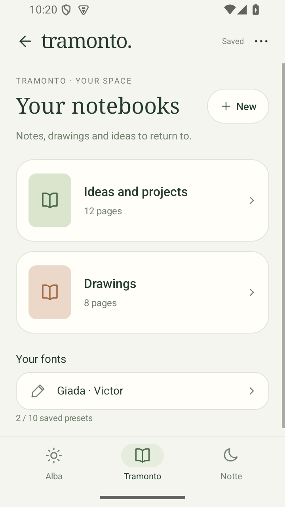
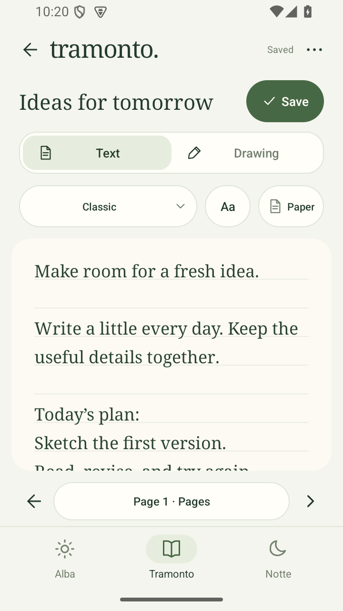
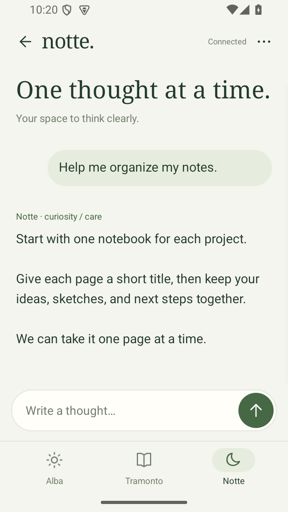

# Alba · Tramonto · Notte — Native Android 1.8.0

Version 1.8.0 adds a searchable page index, previous/next controls, automatic
saving after edits, and short transitions respecting system animation settings.
Ruled text follows the actual text baselines at every font size. Changes to the
title, paper or font preserve the original HTML. Chat updates retain existing
message views and preserve text typed while a message is being sent. Personal
fonts update only the edited text range instead of rebuilding the whole page.

<p>
  
  
  
</p>

English screenshots from the native emulator with public sample content.

The approved mobile redesign uses outline icons, compact bottom navigation,
notebook cards, rounded sheets and light/dark themes. Chat has open assistant
prose and a compact composer. The notebook keeps Text and Drawing tabs; drawing
tools float over the paper, with a fullscreen mode, eraser, colors and width.
The font picker previews saved glyphs. Library font presets can be renamed with
optimistic version checks; existing glyphs are retained. Paper selection supports
plain, ruled and grid layouts. Changing theme preserves encrypted unsaved drafts.

This release separates background polling from interactive requests, discards
page responses after navigation, and offers Save & leave for unsaved notes.
Expired sessions retain encrypted drafts for the same account; switching accounts
clears old jobs and drafts. Font collections may use the larger response budget
needed for up to ten saved presets. Native note text uses the saved vector font,
with readable fallback for glyphs that have not been drawn yet.

The dropdown includes Test Lab and Project & evolution. Test Lab selects an
installed model and seven strategies: Notte SSD, ARM, KV8, Draft, Warm, CPU2 and
Flux. Comparison always runs standard first, then the selected strategy.
Results use four native Canvas bar charts (first token, total wait, decode speed
and output tokens); JSON and standalone HTML/SVG reports can
be exported. Live polling preserves the prompt field. Project news/history are
native cards with an explicit external link to the public IT/EN information site.
See [the lab protocol and measurement limits](../docs/TEST_LAB.md).
See [adaptive budgets and model retention](../docs/ADAPTIVE_RUNTIME.md).
Warm comparisons reuse residency; Flux changes response budgets and instructions;
KV8 reduces cache precision. These conditions are displayed in reports.

The Android app uses Java and Android Views. It contains **no WebView, Javascript engine or browser UI**. Bottom navigation opens Alba, Tramonto notebooks and Notte. A grouped More menu contains memory, topic diary, all activity, personal-model training, token statistics, emotions, hardware and settings. Notes have Text and Drawing tabs, a font picker, text size and spacing, and a fullscreen drawing mode with eraser and undo.

Italian and English UI follow the phone language, with a manual choice in Settings. AI responses follow the language of the message. The AI, SQLite database, notebooks and training run on the Raspberry; the APK is a native network client, not an on-phone LLM. HTTPS is required.

Login uses your existing account or a one-time `/web_key` Telegram link. Sessions and recovered page drafts are encrypted with an Android Keystore key, excluded from backups. Drafts are bound to the authenticated account and server, and cleared on logout or account changes. Passwords and one-time keys are not stored. API mutations use CSRF and same-origin requests; redirects and invalid TLS certificates are rejected. HTTP 401 / expired sessions return to native login.

Tramonto has native text editing, ink, JSON export and optimistic version checks. Saving preserves existing graph, formula, circuit, network and image data. Its complete visual math/electronics/network laboratories remain in the existing web portal; native editing of those advanced objects, image upload and PDF printing are not part of this release. The native APK does not open that portal inside itself.

The package `local.alba`, signing certificate and HTTPS App Links remain unchanged. Update the APK without uninstalling. The first native login is required because the old browser session cannot be reused by the native API client. Phone-specific Telegram in-app browser settings may still affect external app opening.

## Build

Python 3.9+, JDK 17, Android SDK 36 and build-tools 36.0.0:

```sh
python3 android/build.py --sdk /path/to/android-sdk --server https://alba.example.org
```

Output: `dist/alba-albi.apk`, `dist/assetlinks.json`. The private signing key stays in `~/.local/alba-signing`; keep it for future updates. Publish the generated assetlinks at `/.well-known/assetlinks.json` on the same HTTPS origin. The manifest host is generated from `--server`.

## Native UI verification

```sh
python3 android/test_native.py --sdk /path/to/android-sdk
adb install -r dist/alba-albi.apk
adb install -r android/build/smoke/native-smoke.apk
adb shell am instrument -w local.alba.smoke/local.alba.NativeUiSmoke
```

The test APK is separate from the release. Its native checks cover native markdown/table rendering, menu navigation, warm links, rejected external link keys, account-bound chat drafts, diary, training/system/activity screens, Italian/English UI, notebook content preservation, personal fonts, drawing and versioned saving. Theme recreation also verifies unsaved page, font and paper preservation. Screenshots cover chat, notebooks, font selection, drawing, settings and menu on a 360 × 640 dp phone in dark and light themes. Controlled HTTP connections exercise concurrent requests, credential clearing, expired sessions and response limits in the real NativeApi transport. It never uses real credentials, trains models or sends Telegram messages. Production API tests verify authentication, authorization and CSRF independently. GitHub Actions runs the emulator on the CI runner, not on the user's Mac. Test signing keys created in CI are ephemeral; published APKs use the existing release key.

To refresh the English documentation images, run the instrumentation above, then:

```sh
adb pull /sdcard/Android/data/local.alba/files/smoke-docs-library.png docs/android-notebooks.png
adb pull /sdcard/Android/data/local.alba/files/smoke-docs-notebook.png docs/android-notebook.png
adb pull /sdcard/Android/data/local.alba/files/smoke-docs-chat.png docs/android-chat.png
```
