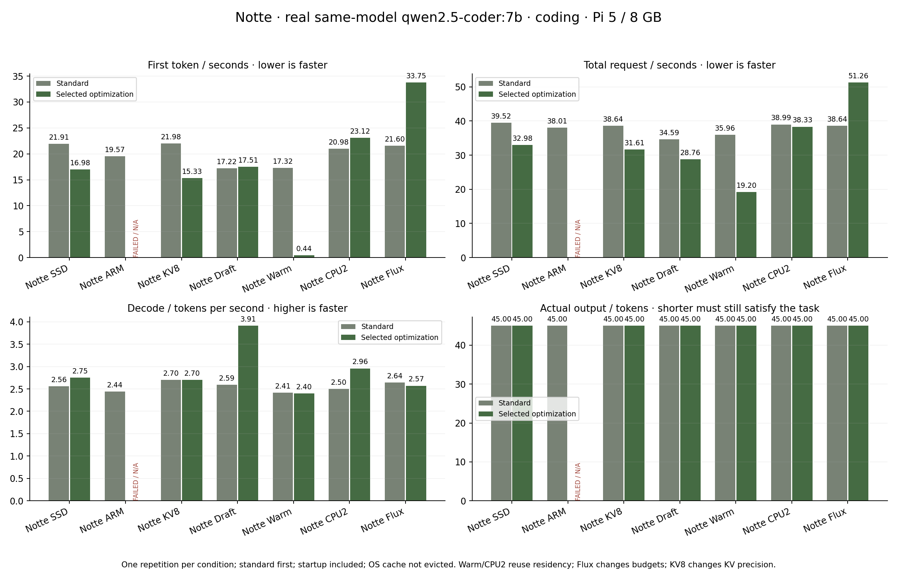
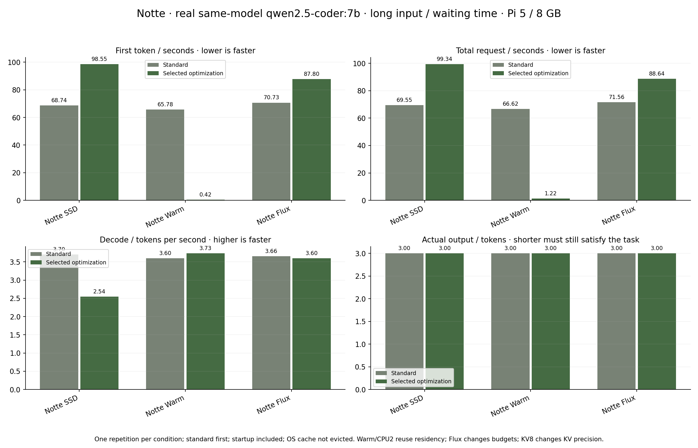

# Notte 1.5 — measured strategy campaign

Date (UTC): 2026-10-04T21:24:48.387497+00:00. Total campaign duration: 875 seconds.

All models and quality checks ran on the Raspberry Pi 5, 8 GB, NVMe, CPU.
No inference, training, model download or Android emulator ran on the Mac.
Plots were rendered offline on the Mac; Android compilation/emulation ran on GitHub.

Target: `qwen2.5-coder:7b`. GGUF SHA-256: `60e05f2100071479f596b964f89f510f057ce397ea22f2833a0cfe029bfc2463`.
The later `notte-coding:latest` alias retains these exact weights.

Sequential standard first then selected policy. One repetition per condition. Startup included, OS file cache not evicted; warm and CPU2 benefit from the preceding standard request. Flux changes instructions/budgets; KV8 quantizes KV. No personal context. No model substitution.

Each strategy gets its own preceding standard run; baseline timings vary.
These are individual probes, not medians, confidence intervals or a broad
coding/knowledge benchmark. Template/backend differences remain.

## Coding: standard → selected strategy

Prompt: `Scrivi solo la funzione Python unique(values): rimuovi duplicati mantenendo ordine. Nessuna spiegazione.`
Context 1024; requested output ceiling 96; temperature 0, seed 42.

| Strategy | First token s standard → selected | Total wait s standard → selected | Decode token/s standard → selected | Output tokens | Function check |
| --- | --- | --- | --- | --- | --- |
| Notte SSD | 21.908 → 16.977 | 39.518 → 32.981 | 2.555 → 2.749 | 45.000 → 45.000 | 3/3 → 3/3 |
| Notte ARM | 19.568 → N/A | 38.011 → N/A | 2.440 → N/A | 45.000 → N/A | 3/3 → N/A |
| Notte KV8 | 21.982 → 15.330 | 38.641 → 31.615 | 2.701 → 2.702 | 45.000 → 45.000 | 3/3 → 3/3 |
| Notte Draft | 17.217 → 17.512 | 34.593 → 28.762 | 2.589 → 3.911 | 45.000 → 45.000 | 3/3 → 3/3 |
| Notte Warm | 17.315 → 0.438 | 35.957 → 19.195 | 2.414 → 2.399 | 45.000 → 45.000 | 3/3 → 3/3 |
| Notte CPU2 | 20.979 → 23.118 | 38.988 → 38.329 | 2.498 → 2.958 | 45.000 → 45.000 | 3/3 → 3/3 |
| Notte Flux | 21.600 → 33.749 | 38.638 → 51.257 | 2.642 → 2.571 | 45.000 → 45.000 | 3/3 → 3/3 |



Thirteen successful coding outputs pass three independent isolated execution cases:
`[3,1,3,2,1] → [3,1,2]`, `[] → []`, and `["a","A","a"] → ["a","A"]`.
Every successful output contains the same complete function and 45 declared
output tokens; no output reaches its ceiling. This checks one function on these
inputs, not arbitrary unhashable objects, security or general coding intelligence.
The operator campaign alone executes its own public probe in the existing
sandbox; online user prompts are not automatically executed.

ARM repack is rejected because a second complete weight copy cannot fit the
conservative memory forecast. Its 84 ms failure is stored as diagnostics and
excluded from all speed bars. KV8 changes KV precision, despite passing this
small functional check; it is not presented as lossless.

## Long input: first token and complete waiting time

The public input repeats `dato=17; altro=25; la risposta va alla fine.` 34 times
and ends with `Quanto fa 17+25? Rispondi solo con il numero.`.
Context 2048; requested output ceiling 48. Complete prompts/outputs and
declared input token counts are preserved in [JSON](ADAPTIVE_RESULTS.json).

| Strategy | First token s standard → selected | Total wait s standard → selected | Decode token/s standard → selected | Answer check |
| --- | --- | --- | --- | --- |
| Notte SSD | 68.740 → 98.553 | 69.551 → 99.342 | 3.703 → 2.544 | 42 → 42 |
| Notte Warm | 65.783 → 0.422 | 66.621 → 1.221 | 3.596 → 3.733 | 42 → 42 |
| Notte Flux | 70.734 → 87.799 | 71.555 → 88.637 | 3.658 → 3.597 | 42 → 42 |



## What the measurements justify

SSD reduces the short coding probe total wait by about 16.5%; Draft by about
16.9% and raises its decode rate by about 51.1%. The long-input SSD probe
regresses from 69.551 to 99.342 seconds. These are different workloads.
Warm mainly avoids loading and recomputing the identical prompt; its second
run is deliberately warm, so its large gain is not a cold-start kernel result.
CPU2 improves decode here but barely changes total wait. Flux adds planning
instructions and fails to accelerate this already concise coding task:
38.638 → 51.257 seconds. It remains selectable, rather than being claimed
the universal best policy. Chat budgets address excessive response length,
not a guaranteed faster token generation rate.

Large weights do not become fluid just by sitting on SSD. The prior actual
8.99 GB 14B experiment remains about 0.10 token/s and failed its function
probe; see [the earlier SSD report](SSD_RUNTIME_RESULTS.md). It was not
rerun here or swapped for a small model. MoE streaming and other architectural
directions are documented separately in [runtime research](ADAPTIVE_RUNTIME.md).

## Engineering validation

* Backend: the 378-test campaign suite passes on Pi/Python 3.13, zero skips; Mac/Python 3.9 also
  passes with five platform-dependent skips. A final regression test additionally
  covers hiding embedding dependencies when Ollama tags omit capabilities
  (380 tests in the final suite). Fixture outputs are not hardware measurements.
* Browser: Test Lab and Notte checks pass for private/public separation,
  standard-first chosen-policy submission, four charts, report exports,
  fixed input height, preserved drafts, IT/EN and mobile layout. Failed
  runtimes are N/A rather than fake fast bars.
* Android: native Canvas and Views, no WebView. Compilation and instrumentation
  pass with 61 native UI checks in GitHub Actions; the APK uses the established production certificate.
* Resource ownership: one inference lock; background study/reflection/training
  pauses during this campaign and its four flags are restored in `finally`.
  After chat completion, background work also observes a 120-second grace.
* Model retention checks cover the active/verified previous pair, rejected
  candidates, deletion failures, alias SHA verification and preserved private `.env`.

The first local suite exposed two outdated fixed-budget assertions; they
were updated to the new brief/code policies and the complete suite rerun.
No benchmark failures or regressions were removed from the dataset.

## Reproduce and inspect

```sh
python -m core.benchmark_matrix --root /home/dvlce/supporto-ai \
  --output /home/dvlce/supporto-ai/data/core-lab-campaign/public-results.json \
  --model notte-coding:latest
python docs/plot_adaptive_results.py
```

The campaign uses a temporary private administrator session, publishes only
its own fixed prompts, deletes that session and restores background flags.
The plotter reads curated JSON and performs no inference. Start the campaign
only when foreground chat and training are idle.

Online comparison: `/optimization#test` or the Notte/native Android Test Lab.
One submit runs **standard first, then the selected optimization**, with four
bar charts and private exports. Public news/history never reads private runs.

## Completed installation cleanup

After encrypted backup, production now exposes `notte:latest` (original Qwen2.5
1.5B weights) and `notte-coding:latest` (original Qwen2.5-Coder 7B weights).
Thirteen obsolete or unrelated Ollama tags were removed after alias SHA
verification. Embedding and the internal 0.5B speculation GGUF remain technical
dependencies. The daily experimental personal LoRA has one verified active
checkpoint (`20261004-7`) today; there is no verified previous checkpoint yet.
The policy retains at most current plus verified previous when one exists;
rejected checkpoint 9 did not become the rollback. Training reports/logs and
all original memory remain. Names do not imply the 1.5B/7B weights were trained.

Measured filesystem free space changed from 176,896,315,392 to
196,648,759,296 bytes after cleanup: approximately **19.75 GB freed**
(18.40 GiB). This is filesystem measurement, not a sum of shared alias sizes.
Alba restarted and passed its health check. A private environment/config backup
and the application's encrypted database backup were created before migration.

## Retention regression found during final verification

The next daily candidate (`20261005-10`) was correctly rejected, but its tag
remained installed. The bounded service CLI environment lacked HOME and Ollama
exited with `panic: $HOME is not defined` before deletion. Retention now uses
the existing local Ollama DELETE API under the inference lock. HTTP 404 means
already removed; other failures preserve the adapter and log an error. Tests
verify only obsolete candidates are deleted, protected checkpoints survive,
server failure preserves data, and a missing tag does not leave its adapter
forever. Production cleanup is verified after applying this correction.
