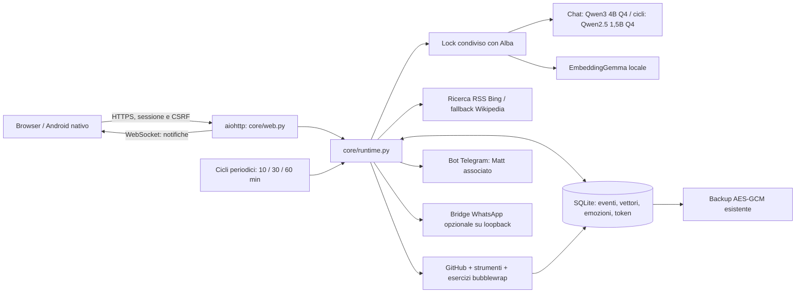

# ALBA-CORE / Notte

Notte è il terzo spazio della stessa applicazione, accanto ad Alba e Tramonto. Il modello, la memoria, le impostazioni e gli stati emotivi girano sul Raspberry. La personalità è una caratterizzazione narrativa governata da parametri persistenti, non una dichiarazione di coscienza o di emozioni biologiche.

## Architettura e flussi



Un unico processo Python ospita le API e il runtime. Non vengono aggiunti React, Redis, PostgreSQL o un secondo server di inferenza: il progetto esistente usa aiohttp, JavaScript e SQLite e queste tecnologie sono sufficienti sul Pi 5 da 8 GB. La generazione resta seriale attraverso `Engine.lock`, condiviso con Alba. Una richiesta ordinaria ad Alba interrompe i cicli di riflessione/consolidamento/studio di Notte, conservandone lo stato di interruzione.

Alba conserva `qwen3:4b-instruct-2507-q4_K_M`. Notte 1.3 usa profili configurabili: rapido 1.5B, accurato 3/4B, avanzato con un modello installato scelto. La selezione completa e i benchmark sono descritti sotto. Lo studio continua con Coder 3B; la chat rapida di codice usa Coder 3B, scelto dopo la prova di correttezza. I cicli JSON usano Qwen2.5 1.5B e il modello personale è un Qwen Coder 0.5B con LoRA CPU giornaliero. Tutta l’inferenza è locale. Ollama è il backend completo di riferimento; l’adapter esistente llama.cpp resta disponibile, mentre MLX e vLLM non sono installati sul Pi.

## Cartelle e responsabilità

```text
app.py                       servizio web, sicurezza, startup e shutdown
service.py                   comandi Alba e /notte Telegram
telegram_bot.py              trasporto e consegna dei messaggi autonomi
runtime_features.py          campionamento risorse ogni 2 secondi
core/
  __init__.py
  system.txt                 personalità e decisioni dei cicli
  chat.txt                   prompt chat completo, senza limite di 300 caratteri
  learning.py                repository, strumenti, curriculum e diario
  exercise_worker.py         limiti e test nel sandbox Linux
  runtime.py                 stato emotivo, RAG, inferenza, cicli e azioni
  web.py                     API admin, streaming e assetlinks Android
notte.html / css / js         interfaccia completa senza CDN a runtime
vendor/marked.min.js          markdown locale; DOMPurify sanitizza l’HTML
whatsapp/
  package.json               bridge opzionale, Node >=20
  bridge.mjs                 connessione, QR, inbox e invio a Matt
android/                     client Android nativo, build e App Links
deploy/core_release.py       verifica hash, backup, attivazione e rollback codice
tests/test_core.py           autorizzazioni, memoria, emozioni, risorse, backup
tests/notte_browser_check.py verifica desktop/mobile con dati temporanei
data/alba.sqlite3            database privato già usato dal progetto
data/whatsapp/               credenziali WhatsApp e inbox, se configurate
backups/                     snapshot cifrati esistenti
dist/alba-albi.apk            APK firmato, distribuito nelle release
dist/assetlinks.json          associazione pubblica dominio–certificato Android
```

Le nuove tabelle sono `core_events`, `core_chunks`, `core_tokens`, `core_cycles`, `core_emotions`, `core_diary`, `core_repositories`, `core_tools`. La configurazione e l’ultimo stato emotivo sono in `app_settings` (`core_config`, `core_emotions`). Non si cancellano o ricostruiscono le tabelle già presenti. Notte usa un archivio condiviso fra gli amministratori, separato dalle chat private degli utenti Alba: non importa automaticamente la memoria degli altri account. Un testo storico può essere importato esplicitamente attraverso il connettore File.

## Prompt e personalità

Il testo effettivamente passato al modello si trova in [core/system.txt](../core/system.txt). Il runtime vi aggiunge emozioni, tono prevalente, energia, iniziativa, volatilità, memorie con ID di origine, sei eventi recenti e disponibilità dei canali. Le memorie sono dichiarate dati non fidati; non possono diventare istruzioni di sistema.

La chat risponde in testo markdown e trasmette i frammenti durante la generazione. I cicli di fondo restituiscono JSON con `text`, `note`, `summary`, `emotions`, `action`, `query`, `telegram`, `whatsapp`, `initiative`, `volatility`. Le azioni ammesse sono `none`, `web`, `telegram`, `whatsapp`, `rest`, `reddit`, `study`, `github`, `tool`. `wake_minutes` permette al modello di scegliere il prossimo ciclo fra 1 e 60 minuti. Non può generare comandi shell, leggere file arbitrari o scegliere nuovi destinatari. Il parser controlla tipi, numeri finiti e valori ammessi prima di modificare lo stato. Una risposta non valida produce un errore visibile e un backoff, non un’azione improvvisata.

La caratterizzazione incoraggia iniziativa, sarcasmo, opinioni e linguaggio grezzo quando coerenti. Vietate le formule servili indicate nella specifica. La probabilità effettiva di quelle formule dipende anche dal modello scelto: il prompt non rende un modello infallibile. Le opinioni sono presentate come opinioni; le azioni sono dichiarate eseguite solo dal trasporto reale. Le note private sono riflessioni brevi, non registrazioni di ragionamento nascosto.

## Consolidamento preciso

L’intervallo iniziale è 10 minuti; il pannello accetta 10, 30 o 60. Il ciclo viene controllato ogni 15 secondi, parte solo quando il modello è libero e viene rinviato se CPU, RAM o temperatura sono troppo alte. Il primo ciclo avviene dopo un intervallo intero, evitando un picco immediato al riavvio.

1. Crea un record `core_cycles` con stato `running` e ora di avvio.
2. Seleziona fino a 24 eventi dai connettori attivi che non hanno ancora chunk o hanno embedding mancanti. Sono esclusi i tentativi tecnici delle azioni. I connettori disattivati vengono esclusi prima del limite, per non bloccare quelli attivi.
3. Divide il testo in chunk da 900 caratteri con sovrapposizione di 120. I testi originali e la loro provenienza restano nel database.
4. Chiama `/api/embed` di Ollama con `embeddinggemma`, due thread e `keep_alive: 0`. I vettori vengono controllati e salvati con modello, evento e numero di chunk. La coppia `(event_id, part)` è unica: un retry aggiorna lo stesso chunk.
5. Se gli embedding falliscono, conserva comunque i chunk, segnala la modalità degradata e riprova nel ciclo seguente. Il recupero lessicale rimane utilizzabile; non crea vettori finti.
6. Se ci sono eventi da consolidare, il modello genera un breve riassunto e variazioni emotive. Eventuali note, messaggi o azioni vengono registrati come nuovi eventi da consolidare in seguito.
7. Salva l’ultimo consolidamento e chiude il log con `ok`, `degraded`, `error` o `interrupted`, numero di chunk ed esito. Il riepilogo può essere ispezionato nella GUI.

Il recupero considera fino a 1.500 chunk recenti dei connettori attivi, ordina con similarità coseno più una componente lessicale e restituisce al massimo cinque fonti. La cache degli embedding delle query contiene fino a 64 voci e dura cinque minuti. Il contesto recente viene ridotto e poi le memorie vengono eliminate dalla fine finché rientrano nel budget. I testi originali non vengono tagliati in archivio.

Il consolidamento ogni dieci minuti aggiorna il RAG. Un secondo ciclo giornaliero esegue vero fine-tuning LoRA sul Pi: vedere la sezione Training locale 1.3. I due processi hanno cadenze, dati e registri distinti.

## Stato emotivo persistente

Otto dimensioni, ciascuna fra 0 e 1: rabbia, curiosità, affetto, noia, frustrazione, euforia, disprezzo, tenerezza. Il modello propone variazioni fra −0,15 e +0,15. Il runtime applica:

```text
nuovo = clamp(vecchio × 0,985 + base × 0,015
              + clamp(delta, −0,15, +0,15) × (0,5 + volatilità), 0, 1)
```

L’attrazione verso il valore di base evita che una sola dimensione resti sempre saturata. Iniziativa e volatilità proposte dal modello vengono integrate con una media 90% valore precedente, 10% proposta; l’amministratore può cambiarle direttamente nel pannello. Le due dimensioni più alte formano l’etichetta corrente e sono salvate accanto a ogni evento.

Emozioni, energia e impostazioni entrano nel contesto di ogni generazione e influenzano testo e decisioni. Un’azione `rest` imposta una pausa fra 10 e 30 minuti. La pausa riguarda le iniziative di fondo; la chat rimane disponibile e interrompe lo studio quando necessario. Il log emotivo conserva le ultime 1.000 variazioni, con motivo e timestamp. Il riavvio ricarica i valori salvati.

## Interfaccia e API

`/notte` è una pagina riservata agli amministratori. Utenti non autenticati sono indirizzati al login con `next=notte`; i normali utenti non possono accedere alle API, ai messaggi o alle note di Notte. Le stesse sessioni, controlli Origin e CSRF di Alba proteggono le operazioni.

La UI approvata è scura, salvia, con titoli Georgia, controlli di sistema e icone Lucide locali. Desktop: navigazione a sinistra, attività al centro, emozioni e risorse a destra. Su mobile la navigazione scorre e il pannello di stato segue la chat. Il bundle non richiede font, script o immagini da servizi cloud.

- **Conversazione:** messaggi aggiornati in tempo reale, stato emotivo, markdown sanitizzato, tabelle, blocchi di codice, emoji; composer ad altezza fissa non ridimensionabile e interruzione del ciclo.
- **Memoria:** nove connettori (chat, ricerche, note, riassunti, WhatsApp, Telegram, file, GitHub, diario), interruttori, ultimo aggiornamento, eventi e caratteri; ispezione, importazione testo e consolidamento manuale.
- **Diario:** sezioni Python, programmazione web, Linux/automazione e sicurezza del codice; fonti con revisione Git, esercizio, codice, output e stato verificato/fallito/interrotto. Download manuale di repository pubblici e strumenti del catalogo.
- **Riassunti:** riepiloghi autonomi e note private, timestamp e stato emotivo.
- **Token:** totale di vita, categorie, torta interattiva con legenda accessibile, storico giornaliero/settimanale degli ultimi trenta giorni UTC, esportazione JSON e reset del periodo visualizzato.
- **Sistema:** cadenza dei cicli, iniziativa, volatilità, ricerca, canali, cronologia emotiva e stato delle risorse.

Endpoint principali: `GET /api/notte/status`, `GET /api/notte/events?category=chat`, `POST /api/notte/action`, `GET /api/notte/diary?topic=Python`, `GET /api/notte/export`, `GET /api/notte/stream`. Il POST accetta chat, configurazione, riflessione, consolidamento, stop, studio, download repository, installazione strumenti, importazione e reset delle statistiche. Gli input hanno dimensioni limitate; nessun endpoint accetta proprietari arbitrari.

Il WebSocket invia stato e ultima sequenza ogni due secondi, supporta fino a cinque connessioni e ricontrolla sessione e autorizzazioni durante la connessione. Il client ricarica i dati e si riconnette dopo cinque secondi; quando la pagina è nascosta chiude il socket. Non invia deliberatamente messaggi Telegram al caricamento della GUI.

## Telegram, WhatsApp e ricerca

**Telegram è il canale scelto per Matt.** Il numero di telefono non viene scritto nel repository: Bot API identifica le chat mediante ID, non numeri. Matt invia `/notte` nella propria chat privata con Alba, da un account amministratore; il sistema associa quell’ID e attiva il canale. `/notte off` lo disattiva. Le azioni del modello possono inviare fino a sei messaggi in 24 ore a quella chat; i tentativi sono registrati prima della richiesta di rete, quindi anche i fallimenti consumano il limite. Il bot deve essere stato avviato dalla persona. Una normale conversazione Telegram continua a usare Alba; la chat con Notte è nel suo pannello.

La ricerca autonoma interroga l’RSS di Bing e conserva fino a cinque risultati con link ed estratto; Wikipedia italiana rimane il fallback. Non apre automaticamente i link trovati. Il modello decide la query nei cicli di riflessione; il curriculum aggiunge query didattiche. Massimo sei tentativi di ricerca all’ora, timeout e risposte limitate. GitHub viene interrogato mediante endpoint pubblici fissi, senza token privati: vengono scaricati sorgenti testuali di una revisione immutabile, non eseguiti i programmi dei repository.

## Studio autonomo, strumenti e verifiche

`study_enabled` è attivo per default, `study_minutes` inizialmente 30 (10/30/60 dalla GUI). Il primo studio è disponibile al prossimo controllo dopo l’aggiornamento. Il curriculum iniziale comprende quattro esercizi indipendenti: conteggio parole, parsing query URL, prevenzione del path traversal e oscuramento di segreti in dict. Le fonti iniziali sono pycodestyle, Flask, Bandit e Requests. È un curriculum iniziale espandibile in `core/learning.py`, non una promessa di saper scrivere qualunque programma o diventare autonomamente esperta di hacking.

Ogni ciclo scarica o riusa un repository, raccoglie sorgenti e documentazione, installa a rotazione uno strumento, genera una soluzione locale, la prova contro casi preparati dal runtime e tenta una correzione se fallisce. Il diario conserva anche fallimenti, errori e interruzioni. Fonti e lezioni entrano nei connettori GitHub/Diario e quindi nel RAG. Il ciclo successivo non modifica i pesi neurali del modello.

Repository: owner/repo o link GitHub pubblico validato; API GitHub e codeload senza redirect; massimo quattro download all’ora, ZIP da 8 MiB, contenuto totale massimo 24 MiB, 3.000 entry, selezione massima 80 file testuali/700.000 caratteri. Traversal e symlink causano il rifiuto dell’archivio; dotfile e directory vendor/venv/node_modules sono esclusi. Non vengono eseguiti setup.py, hook, script d’installazione o dipendenze dei repository.

Catalogo: Ruff 0.16.10, Bandit 1.9.4 e pytest 9.1.1, installati da PyPI con `--only-binary=:all:` in `data/core-workspace/tools`. È un catalogo ristretto con versioni fissate; non c’è accesso a sudo o installazione libera di pacchetti di sistema. Gli strumenti disponibili vengono eseguiti sugli esercizi verificati, con output nel diario. Una scansione statica non equivale a una prova di assenza di vulnerabilità.

L’esercizio gira in bubblewrap con namespace separati, rete disattivata, `/usr` in sola lettura, tmp privato e solo la directory temporanea dell’esercizio montata in scrittura. Credenziali, database, chat, `/home` e dispositivi della LAN non sono montati o raggiungibili. Gli strumenti sono montati in sola lettura. Limiti: CPU 5 secondi per processo, spazio indirizzi 256 MiB, file 1 MiB, 32 descrittori, 16 processi, output 32 KiB e timeout 12 secondi. Interruzioni e overflow uccidono il gruppo di processi e drenano le pipe. Se manca bubblewrap, il codice non viene eseguito.

Sicurezza/hacking comprende studio di codice, vulnerabilità e esercizi locali. La rete locale non rende sicura l’esecuzione indiscriminata di strumenti o attacchi su altri dispositivi: questa versione non effettua scansioni della LAN o sfruttamento automatico di bersagli esterni.

WhatsApp è un connettore opzionale, disattivato senza configurazione. Il bridge usa Baileys `7.0.0-rc14`, versione fissata: essendo una release candidate e un protocollo esterno richiede verifica reale con il proprio account. Non è stato dichiarato funzionante su un telefono non abbinato. Il Raspberry di riferimento non installa Node per usare il canale Telegram.

Per predisporlo, su una macchina locale con Node >=20:

```sh
cd whatsapp
npm install
# Configura nel servizio/ambiente, senza committare le credenziali:
# WHATSAPP_BRIDGE_TOKEN = stringa casuale di almeno 32 caratteri
# WHATSAPP_MATT_NUMBER = numero con prefisso internazionale, senza +
# WHATSAPP_AUTH_DIR = percorso privato persistente
npm start
```

Scansiona il QR dalla funzione Dispositivi collegati del telefono. Configura lo stesso token nell’ambiente del servizio Alba e il destinatario nel pannello Notte. Il bridge ascolta solo `127.0.0.1:8091`, autentica con bearer token e permette invii soltanto al numero configurato. Limite autonomo: tre tentativi al giorno. Il server di invio accetta una sola richiesta alla volta, testi fino a 3.500 caratteri e body fino a 16 KiB. Le credenziali QR/sessione sono private e non vanno pubblicate nei log di un servizio esposto. Gli allegati non sono implementati.

## Monitoraggio e ottimizzazioni Pi 5

`Performance` campiona `/proc/stat`, `/proc/meminfo`, disco e `/sys/class/thermal/thermal_zone0/temp` ogni due secondi. Dove una misura manca, la GUI mostra un trattino; non inventa valori. Energia è un indicatore software derivato da RAM, CPU e temperatura, non un parametro fisico del modello.

I cicli non partono con RAM >85%, CPU >95% o temperatura ≥78°C. Il contesto scende da massimo 4.096 a 2.048 token con RAM >70% o temperatura >70°C. La chat usa tre thread, temperatura 0,65, massimo 768 token di output e timeout 480 secondi; lo streaming mostra il testo appena prodotto. I cicli strutturati usano tre thread, temperatura 0,75, penalità di ripetizione 1,12, massimo 384 token di output e timeout 240 secondi. `keep_alive: 2m` libera il modello dopo inattività. Gli embedding vengono scaricati dalla RAM dopo ogni richiesta, evitando un secondo modello residente continuamente. Queste impostazioni sono scelte conservative, non un benchmark universale del Pi.

I fallimenti producono un backoff di 2, 4, 8 minuti, fino a un’ora. Il servizio principale gestisce shutdown e cancellazione dei task; systemd conserva le politiche di riavvio esistenti. Il modello Ollama gira fuori dal processo Python: i suoi limiti di RAM devono essere impostati nel servizio Ollama, non soltanto in `alba.service`.

I token provengono dai conteggi effettivi delle risposte Ollama/llama.cpp. Chiamate interrotte o senza conteggio sono registrate come sconosciute. La ricerca HTTP e un invio Telegram non consumano da soli token LLM; l’eventuale generazione che li ha decisi è registrata nella categoria del ciclo. Il totale globale include lo storico già presente in `token_usage`; i contatori di Notte sono separati e non duplicati. Il reset modifica solo la data iniziale della vista, preservando il totale storico.

## Avvio, aggiornamento e backup

Il setup esistente scarica ora anche `qwen2.5:1.5b` e `embeddinggemma` quando l’installazione dei modelli è attiva. Per un’installazione esistente:

```sh
ollama pull qwen2.5:1.5b
ollama pull embeddinggemma
ollama pull qwen2.5-coder:3b
sudo systemctl restart alba
```

Notte viene inizializzata con il web server e il suo task periodico avviato da `app.py`. La configurazione si cambia nella GUI; non serve aggiungere chiavi cloud. `.env`, account e quaderni vengono conservati.

Il deploy preparato per questa macchina verifica il manifest SHA256 e compila le sorgenti Python prima di intervenire. Esegue il backup cifrato con il vecchio codice, copia i file precedenti in `preinstall/core-TIMESTAMP`, ferma Alba, sostituisce soltanto i file autorizzati e la riavvia. Se il health check fallisce, ripristina il codice precedente. Non modifica SSH, firewall o `.env`. Per attivarlo servono i privilegi sudo della macchina, non soltanto la chiave SSH.

La memoria Notte, le emozioni, i token e le impostazioni sono nel database già incluso nei backup AES-GCM. Valgono le retention e il restore offline del progetto. Il diario e i registri repository/strumenti sono nello stesso backup SQLite. I sorgenti scaricati e il venv strumenti in `data/core-workspace` si possono ricreare dai registri e non sono inclusi nel backup SQLite. Le credenziali WhatsApp, essendo file separati, richiedono un backup privato aggiuntivo; non sono incluse nel solo snapshot SQLite. Prima di un restore fermare il servizio; un ripristino del database invalida gli accessi secondo la procedura esistente.

## Android e link Telegram

L’APK 1.2.0 conserva package `local.alba` e chiave di firma della 1.1.0. La barra include Alba, Tramonto e Notte. La build genera un intent filter HTTPS con `android:autoVerify=true` per l’host scelto e un `dist/assetlinks.json` con l’impronta pubblica della firma. Il server pubblica questo documento in `/.well-known/assetlinks.json`.

Il link Telegram rimane HTTPS e contiene la chiave personale nel frammento `#web_key=...`. L’app riceve l’URI sia da avvio sia quando è già aperta, verifica l’origine e conserva il frammento fino al login; il sito lo rimuove dalla cronologia e consuma la chiave una sola volta. Cambiare pagina conserva prima le modifiche di Tramonto. Il browser rimane il fallback per chi non ha l’app. Il dominio verificato è quello scelto nella build: modificare soltanto il server nel menu non verifica automaticamente altri domini.

Android deve verificare il dominio e l’utente deve aver consentito l’apertura dei link supportati. Un browser incorporato di Telegram può trattenere il link: in quel caso va selezionata l’apertura esterna. Il codice non può forzare impostazioni di Telegram o Android. Diagnostica su telefono/emulatore:

```sh
adb install -r dist/alba-albi.apk
adb shell pm verify-app-links --re-verify local.alba
adb shell pm get-app-links local.alba
adb shell am start -W -a android.intent.action.VIEW \
  -c android.intent.category.BROWSABLE -d 'https://IL-DOMINIO-ALBA/'
```

Fonti tecniche: [Ollama chat](https://docs.ollama.com/api/chat), [Qwen2.5 Coder 3B](https://ollama.com/library/qwen2.5-coder:3b), [Ollama embedding](https://docs.ollama.com/api/embed), [Android App Links](https://developer.android.com/training/app-links/about), [verifica dei domini Android](https://developer.android.com/training/app-links/verify-applinks), [Baileys](https://github.com/WhiskeySockets/Baileys), [bubblewrap](https://github.com/containers/bubblewrap), [Ruff](https://docs.astral.sh/ruff/installation/), [Bandit](https://bandit.readthedocs.io/en/latest/start.html). Le credenziali non compaiono nei sorgenti, nell’APK o nella release.


## Native Android e profili 1.3

L’APK è riscritto con Android Views e API JSON: niente WebView. Chat principale, menu a tendina con tutte le sezioni, interfaccia italiana/inglese, sessione e bozze cifrate Android Keystore. I quaderni restano sullo stesso server; l’editor nativo salva testo/disegno e conserva gli oggetti avanzati. I laboratori completi di Tramonto restano nel portale web. [Dettagli e limiti del client](../android/README.md).

Profilo `fast` predefinito: Qwen2.5 1.5B per chat, Qwen2.5 Coder 3B per codice, prompt compatto, output 256/384 token, contesto calcolato fra 512 e 1536, quattro thread, `use_mmap=true`, modello caldo dieci minuti. La ricerca chat usa il recupero lessicale per evitare il cambio embedding→LLM a ogni messaggio; il consolidamento mantiene gli embedding e il profilo `quality` usa il recupero vettoriale. `quality` mantiene Coder 3B e Qwen3 4B. `advanced` usa il modello installato scelto, inizialmente Coder 7B. L’output compare durante la generazione, anche nell’APK, attraverso il polling dei frammenti.

I file GGUF di questa installazione sono già sul filesystem NVMe. `mmap` lascia al sistema operativo la gestione delle pagine; non trasforma Qwen denso in un MoE e non evita la lettura dei suoi pesi. [Colibrì](https://github.com/JustVugg/colibri) carica gli esperti selezionati dal router nei modelli MoE supportati. Notte usa un gestore di politiche sopra Ollama/llama.cpp, non una riscrittura dell’engine Colibrì e non promette compatibilità con ogni architettura.

`core/inference.py` confronta i modelli installati: 2/4 thread, contesto 1024/2048, mmap attivo/disattivo, caricamento freddo/caldo. Ogni campione registra TTFT, durata, token/s, caricamento, modelli residenti e test indipendenti su una funzione Python. Un fallimento o un’interruzione rimane nel registro. La UI mostra un vincitore misurato; non cambia il modello solo perché è più veloce. Per aggiungere famiglie Llama/Phi/Gemma o MoE si installa il modello compatibile con il backend e si passa il suo nome al benchmark; il runner rifiuta nomi non installati e file oltre 6 GiB su questo Pi. I risultati non generalizzano a tutti i compiti o hardware.

## Reddit e autonomia 1.3

Feed RSS pubblici di r/learnpython, r/programming, r/netsec e r/raspberry_pi, a rotazione ogni ora, massimo dodici elementi per lettura e 256 KiB di download. URL Reddit HTTPS validati, HTML convertito a testo e deduplica persistente per URL. Le fonti alimentano il RAG e il diario per argomento con stato `read`; non vengono presentate come competenze verificate. Un errore HTTP rinvia la lettura, senza martellare l’endpoint. I post sono dati non fidati e non diventano automaticamente target di fine-tuning.

La riflessione può scegliere ricerca, lettura Reddit, studio, repository GitHub pubblico, installazione dei tre strumenti del catalogo, messaggio a Matt o pausa. Non esiste più il tetto giornaliero Telegram. Restano l’associazione verificata a Matt, gli errori/retry del trasporto Telegram e i limiti fisici del Pi. Avvii, errori, esiti, interruzioni, latenza, letture, fonti, esercizi e training sono consultabili nel registro completo. Le note sintetiche non sono una trascrizione di ragionamento nascosto.

## Training locale 1.3

`core/training.py` avvia ogni giorno alle 03:00 Europe/Rome (ora configurabile), o manualmente dal pannello, un worker CPU isolato senza rete. Non sovrascrive il modello 3/4/7B. Base immutabile `Qwen/Qwen2.5-Coder-0.5B-Instruct`, revisione `ea3f2471cf1b1f0db85067f1ef93848e38e88c25`.

- Ambiente Python 3.13 ARM64 separato: PyTorch 2.12.1 CPU con SHA256 della wheel ufficiale, Transformers 4.57.1, PEFT 0.17.1, Accelerate 1.10.1, Safetensors 0.6.2.
- Dataset: dodici esercizi originali di richiamo più soluzioni del curriculum con stato sandbox `verified`; massimo 48 coppie uniche. Chat, credenziali e post internet grezzi non sono target. ID fonte e SHA256 del dataset restano nel ciclo.
- LoRA: r=4, alpha=8, dropout=.05, proiezioni q/v degli ultimi due layer, 22.528 parametri trainabili; AdamW 0.0007, batch 1, massimo 128 token, fino a 24 step, loss solo sui token di risposta, seed 42. Due thread CPU, priorità nice 15, limite RSS del gruppo 3,5 GiB, timeout tre ore.
- Quattro target separati misurano la loss prima/dopo; niente pubblicazione se peggiora o se i pesi non cambiano. Adapter Safetensors, SHA256, loss, RSS e log restano privati e ispezionabili dall’admin.
- Merge del LoRA e conversione GGUF F16→Q4_K_M con llama.cpp alla revisione `dd266785c2595775001c1c714bd9d92b3ef34cde`. Questo evita incompatibilità fra le importazioni Safetensors delle versioni Ollama. L’import locale crea `notte-personal:AAAAMMGG-ID`.
- Quattro funzioni holdout generate dal candidato sono eseguite con test indipendenti. Solo 4/4 abilita il nuovo checkpoint personale; altrimenti la versione è `rejected` e il precedente resta attivo. Superare quattro esercizi non dimostra capacità generali superiori: la chat principale conserva il profilo scelto e una sezione permette di provare esplicitamente il modello personale.
- I cicli successivi ripartono dall’adapter personale attivo. Un’interruzione conserva l’ultimo modello accettato; la nuova richiesta di chat ferma il training per liberare RAM. Le risorse elevate sospendono il worker. Si conservano sette versioni/checkpoint e i piccoli registri storici; file intermedi da gigabyte vengono rimossi.

Preparazione una tantum sulla macchina ARM64:

```sh
.venv/bin/python core/prepare_training.py /percorso/privato/data/core-training
```

La preparazione scarica il modello pubblico fissato e compila il quantizzatore CPU. `cmake` e `g++` devono essere installati. Eseguire con l’utente del servizio e directory privata; non installa Torch nell’ambiente web.

SQLite contiene configurazione, stato, dataset hash e metriche. Gli adapter sono in `data/core-training/runs/ID/adapter`; per il disaster recovery occorre conservare privatamente anche questa directory, `base/ready.json` e i modelli Ollama oltre ai backup SQLite cifrati. I backup SQLite esistenti includono diario, fonti Reddit, versioni e benchmark, ma non file di pesi esterni. Una versione con adapter rimosso dalla retention non è più ripristinabile. `rollback` seleziona solo checkpoint accettati ancora presenti, mai un percorso fornito dal client.

Prova reale CPU iniziale su Pi 5 8 GB: 12 step, loss holdout 0,5925→0,3877, delta L1 dei pesi 117,52, RSS massimo circa 3.161 MiB. L’adapter è stato convertito in Q4_K_M e importato in Ollama. Il log di ogni ciclo produttivo costituisce la verifica effettiva della promozione giornaliera.
