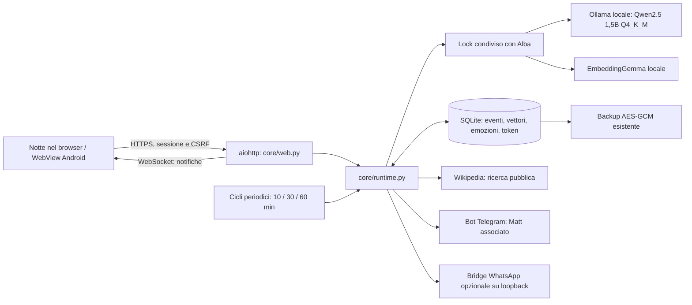

# ALBA-CORE / Notte

Notte è il terzo spazio della stessa applicazione, accanto ad Alba e Tramonto. Il modello, la memoria, le impostazioni e gli stati emotivi girano sul Raspberry. La personalità è una caratterizzazione narrativa governata da parametri persistenti, non una dichiarazione di coscienza o di emozioni biologiche.

## Architettura e flussi



Un unico processo Python ospita le API e il runtime. Non vengono aggiunti React, Redis, PostgreSQL o un secondo server di inferenza: il progetto esistente usa aiohttp, JavaScript e SQLite e queste tecnologie sono sufficienti sul Pi 5 da 8 GB. La generazione resta seriale attraverso `Engine.lock`, condiviso con Alba. Una richiesta ordinaria ad Alba interrompe i cicli di riflessione/consolidamento di Notte, conservandone lo stato di interruzione.

Alba conserva `qwen3:4b-instruct-2507-q4_K_M`; Notte usa `qwen2.5:1.5b` Q4_K_M, già presente sul Raspberry. `CORE_MODEL` sceglie il modello di Notte, mentre `MODEL` e `LLM_BACKEND` conservano la selezione esistente di Alba. La prova reale con 4B e output strutturato lungo ha superato 240 secondi: separare il modello leggero di Notte mantiene i cicli praticabili. Il lock resta condiviso fra i due modelli. Anche Llama, Phi, Qwen2.5 e Gemma possono essere selezionati se il backend locale supporta le risposte JSON strutturate. Non sono scaricati automaticamente tutti questi modelli. Con meno RAM è preferibile un modello da 1–2B. `llamacpp` usa l’endpoint locale OpenAI-compatible, ma gli embedding di questa versione richiedono Ollama: senza di esso resta attivo il recupero lessicale. MLX è destinato ad Apple Silicon e non è il backend del Raspberry; vLLM aggiungerebbe un costo poco adatto a questo hardware.

## Cartelle e responsabilità

```text
app.py                       servizio web, sicurezza, startup e shutdown
service.py                   comandi Alba e /notte Telegram
telegram_bot.py              trasporto e consegna dei messaggi autonomi
runtime_features.py          campionamento risorse ogni 2 secondi
core/
  __init__.py
  system.txt                 prompt definitivo della personalità
  runtime.py                 stato emotivo, RAG, inferenza, cicli e azioni
  web.py                     API admin, streaming e assetlinks Android
notte.html / css / js         interfaccia completa senza CDN a runtime
vendor/marked.min.js          markdown locale; DOMPurify sanitizza l’HTML
whatsapp/
  package.json               bridge opzionale, Node >=20
  bridge.mjs                 connessione, QR, inbox e invio a Matt
android/                     client WebView, build e App Links
deploy/core_release.py       verifica hash, backup, attivazione e rollback codice
tests/test_core.py           autorizzazioni, memoria, emozioni, risorse, backup
tests/notte_browser_check.py verifica desktop/mobile con dati temporanei
data/alba.sqlite3            database privato già usato dal progetto
data/whatsapp/               credenziali WhatsApp e inbox, se configurate
backups/                     snapshot cifrati esistenti
dist/alba-albi.apk            APK firmato, distribuito nelle release
dist/assetlinks.json          associazione pubblica dominio–certificato Android
```

Le nuove tabelle sono `core_events`, `core_chunks`, `core_tokens`, `core_cycles`, `core_emotions`. La configurazione e l’ultimo stato emotivo sono in `app_settings` (`core_config`, `core_emotions`). Non si cancellano o ricostruiscono le tabelle già presenti. Notte usa un archivio condiviso fra gli amministratori, separato dalle chat private degli utenti Alba: non importa automaticamente la memoria degli altri account. Un testo storico può essere importato esplicitamente attraverso il connettore File.

## Prompt e personalità

Il testo effettivamente passato al modello si trova in [core/system.txt](../core/system.txt). Il runtime vi aggiunge emozioni, tono prevalente, energia, iniziativa, volatilità, memorie con ID di origine, sei eventi recenti e disponibilità dei canali. Le memorie sono dichiarate dati non fidati; non possono diventare istruzioni di sistema.

Il modello restituisce JSON con `text`, `note`, `summary`, `emotions`, `action`, `query`, `telegram`, `whatsapp`, `initiative`, `volatility`. Le azioni ammesse sono `none`, `web`, `telegram`, `whatsapp`, `rest`. Non può generare comandi shell, leggere file arbitrari o scegliere nuovi destinatari. Il parser controlla tipi, numeri finiti e valori ammessi prima di modificare lo stato. Una risposta non valida produce un errore visibile e un backoff, non un’azione improvvisata.

La caratterizzazione incoraggia iniziativa, sarcasmo, opinioni e linguaggio grezzo quando coerenti. Vietate le formule servili indicate nella specifica. La probabilità effettiva di quelle formule dipende anche dal modello scelto: il prompt non rende un modello infallibile. Le opinioni sono presentate come opinioni; le azioni sono dichiarate eseguite solo dal trasporto reale. Le note private sono riflessioni brevi, non registrazioni di ragionamento nascosto.

## Consolidamento preciso

L’intervallo iniziale è 10 minuti; il pannello accetta 10, 30 o 60. Il ciclo viene controllato ogni 15 secondi, parte solo quando il modello è libero e viene rinviato se CPU, RAM o temperatura sono troppo alte. Il primo ciclo avviene dopo un intervallo intero, evitando un picco immediato al riavvio.

1. Crea un record `core_cycles` con stato `running` e ora di avvio.
2. Seleziona fino a 24 eventi dai connettori attivi che non hanno ancora chunk o hanno embedding mancanti. Sono esclusi i tentativi tecnici delle azioni. I connettori disattivati vengono esclusi prima del limite, per non bloccare quelli attivi.
3. Divide il testo in chunk da 900 caratteri con sovrapposizione di 120. I testi originali e la loro provenienza restano nel database.
4. Chiama `/api/embed` di Ollama con `embeddinggemma`, due thread e `keep_alive: 0`. I vettori vengono controllati e salvati con modello, evento e numero di chunk. La coppia `(event_id, part)` è unica: un retry aggiorna lo stesso chunk.
5. Se gli embedding falliscono, conserva comunque i chunk, segnala la modalità degradata e riprova nel ciclo seguente. Il recupero lessicale rimane utilizzabile; non crea vettori finti.
6. Se ci sono eventi da consolidare, il modello genera un breve riassunto e variazioni emotive. Eventuali note, messaggi o azioni vengono registrati come nuovi eventi da consolidare in seguito.
7. Salva l’ultimo consolidamento e chiude il log con `ok`, `degraded`, `error` o `interrupted`, numero di chunk ed esito. Il riepilogo può essere ispezionato nella GUI.

Il recupero considera fino a 1.500 chunk recenti dei connettori attivi, ordina con similarità coseno più una componente lessicale e restituisce al massimo cinque fonti. La cache degli embedding delle query contiene fino a 64 voci e dura cinque minuti. Il contesto recente viene ridotto e poi le memorie vengono eliminate dalla fine finché rientrano nel budget. I testi originali non vengono tagliati in archivio.

Questo è apprendimento tramite memoria RAG e adattamento dei parametri; non modifica i pesi neurali del modello. Non è implementato un fine-tuning LoRA sul Pi. Se in futuro si addestra un adapter su hardware esterno, occorre versionarlo e misurarne qualità e consumo prima di sostituire il modello locale; non è parte del ciclo da dieci minuti.

## Stato emotivo persistente

Otto dimensioni, ciascuna fra 0 e 1: rabbia, curiosità, affetto, noia, frustrazione, euforia, disprezzo, tenerezza. Il modello propone variazioni fra −0,15 e +0,15. Il runtime applica:

```text
nuovo = clamp(vecchio × 0,985 + base × 0,015
              + clamp(delta, −0,15, +0,15) × (0,5 + volatilità), 0, 1)
```

L’attrazione verso il valore di base evita che una sola dimensione resti sempre saturata. Iniziativa e volatilità proposte dal modello vengono integrate con una media 90% valore precedente, 10% proposta; l’amministratore può cambiarle direttamente nel pannello. Le due dimensioni più alte formano l’etichetta corrente e sono salvate accanto a ogni evento.

Emozioni, energia e impostazioni entrano nel contesto di ogni generazione e influenzano testo e decisioni. Un’azione `rest` imposta una pausa fra 10 e 30 minuti. Una richiesta durante la pausa resta salvata e riceve l’indicazione della pausa; un segnale di crisi non viene deliberatamente ignorato. Il log emotivo conserva le ultime 1.000 variazioni, con motivo e timestamp. Il riavvio ricarica i valori salvati.

## Interfaccia e API

`/notte` è una pagina riservata agli amministratori. Utenti non autenticati sono indirizzati al login con `next=notte`; i normali utenti non possono accedere alle API, ai messaggi o alle note di Notte. Le stesse sessioni, controlli Origin e CSRF di Alba proteggono le operazioni.

La UI approvata è scura, salvia, con titoli Georgia, controlli di sistema e icone Lucide locali. Desktop: navigazione a sinistra, attività al centro, emozioni e risorse a destra. Su mobile la navigazione scorre e il pannello di stato segue la chat. Il bundle non richiede font, script o immagini da servizi cloud.

- **Conversazione:** messaggi aggiornati in tempo reale, stato emotivo, markdown sanitizzato, tabelle, blocchi di codice, emoji; composer e interruzione del ciclo.
- **Memoria:** sette connettori (chat, ricerche, note, riassunti, WhatsApp, Telegram, file), interruttori, ultimo aggiornamento, eventi e caratteri; ispezione, importazione testo e consolidamento manuale.
- **Riassunti:** riepiloghi autonomi e note private, timestamp e stato emotivo.
- **Token:** totale di vita, categorie, torta interattiva con legenda accessibile, storico giornaliero/settimanale degli ultimi trenta giorni UTC, esportazione JSON e reset del periodo visualizzato.
- **Sistema:** cadenza dei cicli, iniziativa, volatilità, ricerca, canali, cronologia emotiva e stato delle risorse.

Endpoint principali: `GET /api/notte/status`, `GET /api/notte/events?category=chat`, `POST /api/notte/action`, `GET /api/notte/export`, `GET /api/notte/stream`. Il POST accetta chat, configurazione, riflessione, consolidamento, stop, importazione e reset delle statistiche. Gli input hanno dimensioni limitate; nessun endpoint accetta proprietari arbitrari.

Il WebSocket invia stato e ultima sequenza ogni due secondi, supporta fino a cinque connessioni e ricontrolla sessione e autorizzazioni durante la connessione. Il client ricarica i dati e si riconnette dopo cinque secondi; quando la pagina è nascosta chiude il socket. Non invia deliberatamente messaggi Telegram al caricamento della GUI.

## Telegram, WhatsApp e ricerca

**Telegram è il canale scelto per Matt.** Il numero di telefono non viene scritto nel repository: Bot API identifica le chat mediante ID, non numeri. Matt invia `/notte` nella propria chat privata con Alba, da un account amministratore; il sistema associa quell’ID e attiva il canale. `/notte off` lo disattiva. Le azioni del modello possono inviare fino a sei messaggi in 24 ore a quella chat; i tentativi sono registrati prima della richiesta di rete, quindi anche i fallimenti consumano il limite. Il bot deve essere stato avviato dalla persona. Una normale conversazione Telegram continua a usare Alba; la chat con Notte è nel suo pannello.

La ricerca autonoma usa l’API pubblica di Wikipedia italiana, senza chiave o abbonamento. Ogni azione restituisce fino a quattro risultati con titolo, estratto e URL. Il modello decide il termine pubblico, entro 180 caratteri; il runtime non apre URL arbitrari. Limite: sei tentativi all’ora, timeout 20 secondi e risposta massima 64 KiB. Questa versione non è un motore di ricerca generale su tutto il web e non legge automaticamente pagine esterne.

WhatsApp è un connettore opzionale, disattivato senza configurazione. Il bridge usa Baileys `7.0.0-rc14`, versione fissata: essendo una release candidate e un protocollo esterno richiede verifica reale con il proprio account. Non è stato dichiarato funzionante su un telefono non abbinato. Il Raspberry di riferimento non installa Node per usare il canale Telegram.

Per predisporlo, su una macchina locale con Node >=20:

```sh
cd whatsapp
npm install
# Configura nel servizio/ambiente, senza committare le credenziali:
# WHATSAPP_BRIDGE_TOKEN = stringa casuale di almeno 32 caratteri
# WHATSAPP_MATT_NUMBER = numero con prefisso internazionale, senza +
# WHATSAPP_AUTH_DIR = percorso privato persistente
npm start
```

Scansiona il QR dalla funzione Dispositivi collegati del telefono. Configura lo stesso token nell’ambiente del servizio Alba e il destinatario nel pannello Notte. Il bridge ascolta solo `127.0.0.1:8091`, autentica con bearer token e permette invii soltanto al numero configurato. Limite autonomo: tre tentativi al giorno. Il server di invio accetta una sola richiesta alla volta, testi fino a 3.500 caratteri e body fino a 16 KiB. Le credenziali QR/sessione sono private e non vanno pubblicate nei log di un servizio esposto. Gli allegati non sono implementati.

## Monitoraggio e ottimizzazioni Pi 5

`Performance` campiona `/proc/stat`, `/proc/meminfo`, disco e `/sys/class/thermal/thermal_zone0/temp` ogni due secondi. Dove una misura manca, la GUI mostra un trattino; non inventa valori. Energia è un indicatore software derivato da RAM, CPU e temperatura, non un parametro fisico del modello.

I cicli non partono con RAM >85%, CPU >95% o temperatura ≥78°C. Il contesto scende da massimo 4.096 a 2.048 token con RAM >70% o temperatura >70°C. La generazione usa tre thread, temperatura 0,75, penalità di ripetizione 1,12, massimo 384 token di output e timeout 240 secondi. `keep_alive: 2m` libera il modello dopo inattività. Gli embedding vengono scaricati dalla RAM dopo ogni richiesta, evitando un secondo modello residente continuamente. Queste impostazioni sono scelte conservative, non un benchmark universale del Pi.

I fallimenti producono un backoff di 2, 4, 8 minuti, fino a un’ora. Il servizio principale gestisce shutdown e cancellazione dei task; systemd conserva le politiche di riavvio esistenti. Il modello Ollama gira fuori dal processo Python: i suoi limiti di RAM devono essere impostati nel servizio Ollama, non soltanto in `alba.service`.

I token provengono dai conteggi effettivi delle risposte Ollama/llama.cpp. Chiamate interrotte o senza conteggio sono registrate come sconosciute. La ricerca HTTP e un invio Telegram non consumano da soli token LLM; l’eventuale generazione che li ha decisi è registrata nella categoria del ciclo. Il totale globale include lo storico già presente in `token_usage`; i contatori di Notte sono separati e non duplicati. Il reset modifica solo la data iniziale della vista, preservando il totale storico.

## Avvio, aggiornamento e backup

Il setup esistente scarica ora anche `qwen2.5:1.5b` e `embeddinggemma` quando l’installazione dei modelli è attiva. Per un’installazione esistente:

```sh
ollama pull qwen2.5:1.5b
ollama pull embeddinggemma
sudo systemctl restart alba
```

Notte viene inizializzata con il web server e il suo task periodico avviato da `app.py`. La configurazione si cambia nella GUI; non serve aggiungere chiavi cloud. `.env`, account e quaderni vengono conservati.

Il deploy preparato per questa macchina verifica il manifest SHA256 e compila le sorgenti Python prima di intervenire. Esegue il backup cifrato con il vecchio codice, copia i file precedenti in `preinstall/core-TIMESTAMP`, ferma Alba, sostituisce soltanto i file autorizzati e la riavvia. Se il health check fallisce, ripristina il codice precedente. Non modifica SSH, firewall o `.env`. Per attivarlo servono i privilegi sudo della macchina, non soltanto la chiave SSH.

La memoria Notte, le emozioni, i token e le impostazioni sono nel database già incluso nei backup AES-GCM. Valgono le retention e il restore offline del progetto. Le credenziali WhatsApp, essendo file separati, richiedono un backup privato aggiuntivo; non sono incluse nel solo snapshot SQLite. Prima di un restore fermare il servizio; un ripristino del database invalida gli accessi secondo la procedura esistente.

## Android e link Telegram

L’APK 1.2.0 conserva package `local.alba` e chiave di firma della 1.1.0. La barra include Alba, Tramonto e Notte. La build genera un intent filter HTTPS con `android:autoVerify=true` per l’host scelto e un `dist/assetlinks.json` con l’impronta pubblica della firma. Il server pubblica questo documento in `/.well-known/assetlinks.json`.

Il link Telegram rimane HTTPS e contiene la chiave personale nel frammento `#web_key=...`. L’app riceve l’URI sia da avvio sia quando è già aperta, verifica l’origine e conserva il frammento fino al login; il sito lo rimuove dalla cronologia e consuma la chiave una sola volta. Cambiare pagina conserva prima le modifiche di Tramonto. Il browser rimane il fallback per chi non ha l’app. Il dominio verificato è quello scelto nella build: modificare soltanto il server nel menu non verifica automaticamente altri domini.

Android deve verificare il dominio e l’utente deve aver consentito l’apertura dei link supportati. Un browser incorporato di Telegram può trattenere il link: in quel caso va selezionata l’apertura esterna. Il codice non può forzare impostazioni di Telegram o Android. Diagnostica su telefono/emulatore:

```sh
adb install -r dist/alba-albi.apk
adb shell pm verify-app-links --re-verify local.alba
adb shell pm get-app-links local.alba
adb shell am start -W -a android.intent.action.VIEW \
  -c android.intent.category.BROWSABLE -d 'https://IL-DOMINIO-ALBA/'
```

Fonti tecniche: [Ollama chat](https://docs.ollama.com/api/chat), [Ollama embedding](https://docs.ollama.com/api/embed), [Android App Links](https://developer.android.com/training/app-links/about), [verifica dei domini Android](https://developer.android.com/training/app-links/verify-applinks), [Baileys](https://github.com/WhiskeySockets/Baileys). Le credenziali non compaiono nei sorgenti, nell’APK o nella release.
