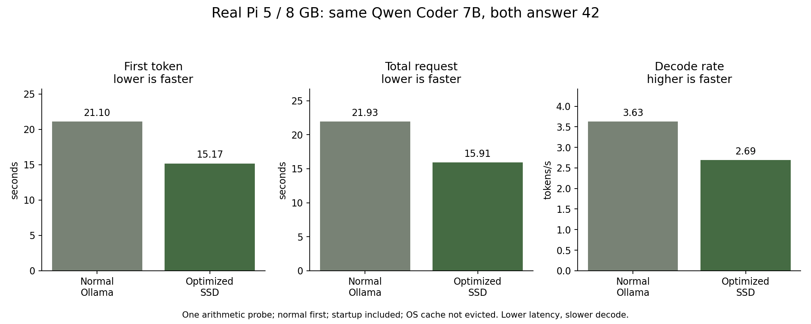

# Test Lab evolution: hardware results and validation

The public IT/EN optimization site and private normal/SSD test bench are now
installed on the actual Raspberry Pi. Native Android 1.4 adds the corresponding
menu sections, real Canvas charts and JSON/HTML/SVG report export. See
[architecture and lab protocol](TEST_LAB.md).

## Actual same-model comparison

4 October 2026, Pi 5 / 8 GB RAM / NVMe, CPU-only. The installed Qwen2.5-Coder 7B
and registered SSD GGUF SHA match. Prompt: `Quanto fa 17+25? Rispondi solo con il
numero.` Both use context 512, output limit 16, temperature 0 and seed 42. Normal
Ollama runs first, followed by the mapped SSD policy. Startup is included; OS
file cache is not evicted. No personal history is supplied.

| Metric | Normal Ollama | Mapped SSD | Interpretation |
| --- | ---: | ---: | --- |
| First token | 21.101 s | 15.171 s | 28.1% lower in this probe |
| Total request | 21.933 s | 15.914 s | 27.4% lower in this probe |
| Decode | 3.627 token/s | 2.693 token/s | SSD is 25.75% slower |
| Output | `42` | `42` | Same text; simple arithmetic only |
| Prompt/output tokens | 47 / 3 | 47 / 3 | Counts reported by each backend |

This is one short probe, not a controlled repetition campaign or general speed
claim. Normal loading alone takes 16.455 seconds. The second runtime can benefit
from already cached weights. Output token identity cannot be checked across
Ollama and SSD because Ollama's stream does not return token IDs; the tool leaves
that metric unavailable. The normal response contains `42`, so faster startup
does not demonstrate improved intelligence or code quality.

Optimized process peak RSS is 4.789 GB, anonymous memory 99 MB, swap zero and
temperature 48.5 °C. No equivalent process RSS peak was sampled for normal
Ollama; before/after system metrics are available privately, not presented as
a comparable process-memory reduction. The production profile, selected model,
SSD flags and daily-study/training configuration were preserved and restored
after the validation script. Both live outputs remain in the private Test Lab
history, while the public site uses only the explicitly curated probe data.

[Raw public JSON](TEST_LAB_RESULTS.json) and
[SVG figure](ssd-results/test-lab-comparison.svg) retain the measured values.
`plot_test_lab_results.py` regenerates the figures offline using the separate
Matplotlib reporting environment. No model runs during chart generation.

## Validation

368 unit tests passed on actual Pi/Python 3.13, zero failures/skips. The new 13
tests cover model identity mismatch, limits, interrupted partial output,
restart recovery, preserved settings, negative performance changes, declared
stream metrics, admin/CSRF and public/private boundaries.

Desktop/mobile browser fixtures passed fixed prompt height, input preservation,
two response cards, automatic charts, standalone report download, IT/EN and
public-feed exclusion of a private marker. Android compilation and 59 native
UI checks passed on GitHub's emulator, including the new Canvas charts, selected
model request, input preservation and native evolution cards. Fixture rates are
not hardware measurements and are not included in the public benchmark plots.

The first CI run found a browser-only dependency being imported during unit
discovery. Moving that import into the standalone browser test resolved it;
subsequent backend and Android checks passed. No LLM or Android emulator ran on
the Mac. The APK is compiled on CI and signed locally with the established
release certificate.

Large-model limits from the [preceding SSD report](SSD_RUNTIME_RESULTS.md)
still apply: the 14B is about 0.10 token/s and long-history 7B chat takes minutes.
This Test Lab makes those measurements inspectable; it does not remove them.
